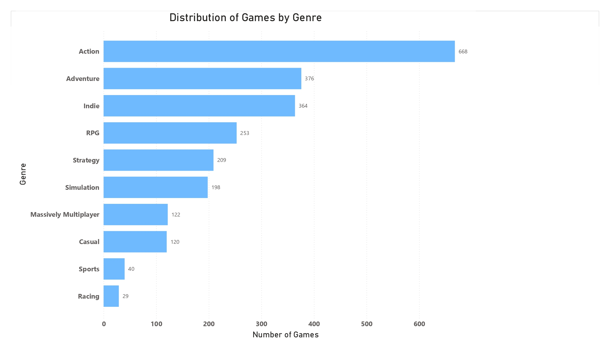
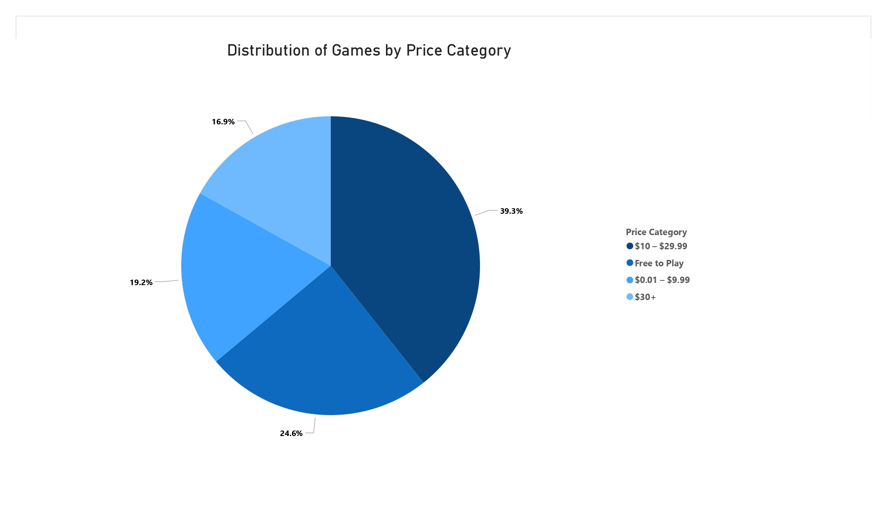
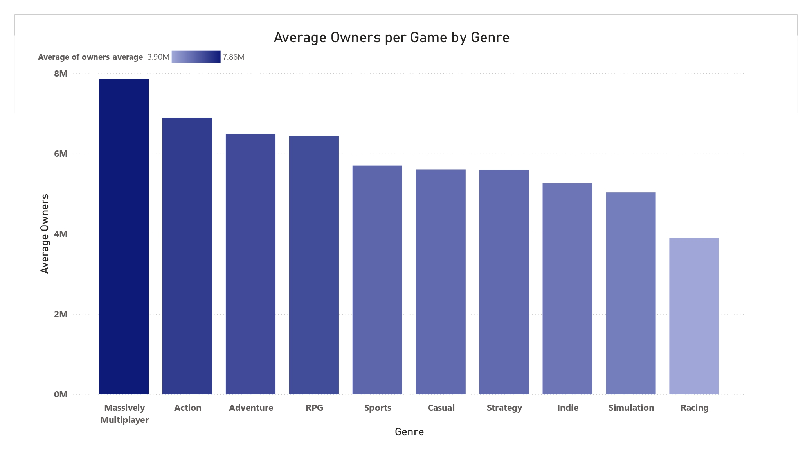
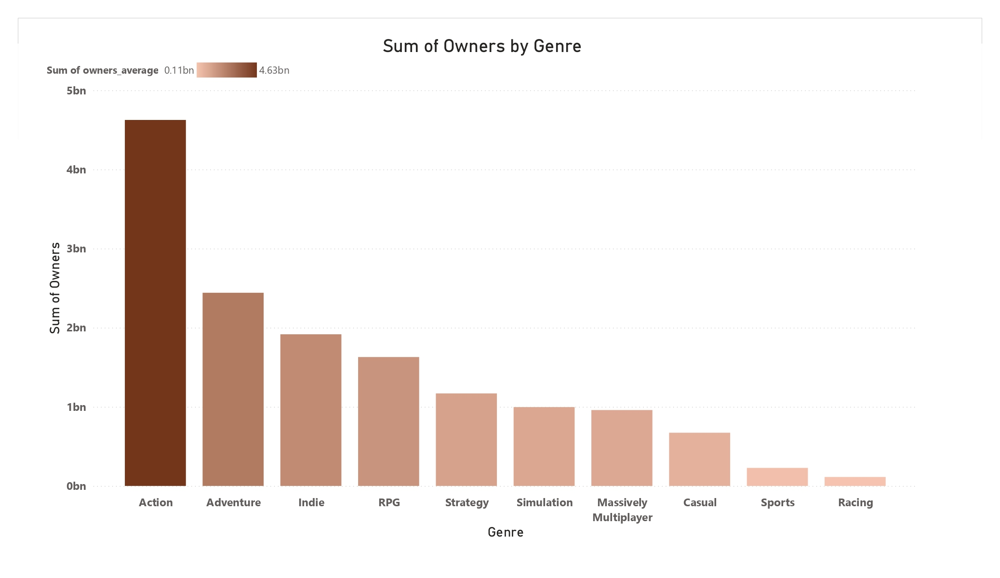
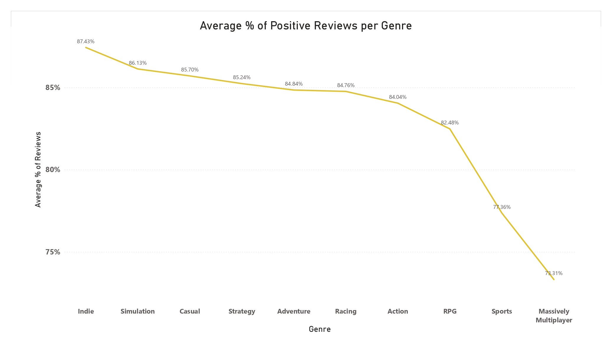
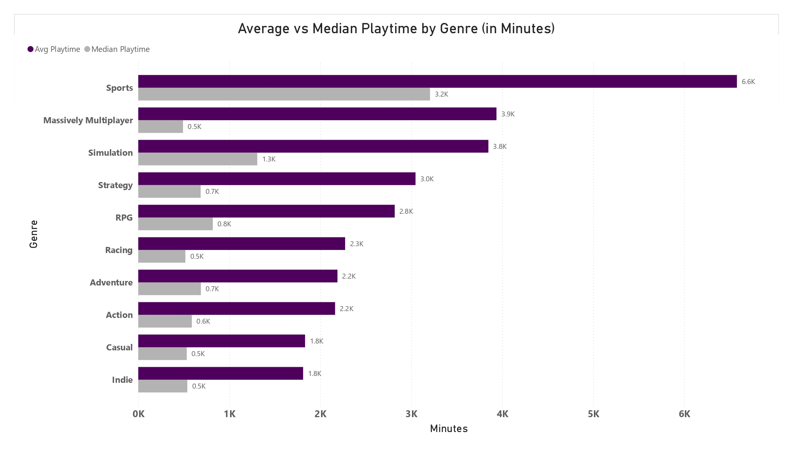

# Steam Player Retention: Understanding What Keeps Gamers Engaged

## Overview
This project investigates **player behavior on the Steam platform**, focusing on the lifecycle of games, differences across genres, and the role of content in retaining engagement. Using real data and interactive dashboards, we aim to identify what keeps players coming back — or dropping off — over time.

## Tools & Dataset
- **Data collection:** Python (SteamSpy public data)
- **Data cleaning & transformation:** Google Sheets
- **Visualization:** Power BI
- **Dataset:** [SteamSpy public data](https://steamspy.com/api.php), [SteamCharts API scraping](https://steamcharts.com/)

---

## Section 1 – Game Lifecycle Analysis

### Business Question
How do Steam games perform after launch? Understanding growth patterns, peak timing, and player drop-off rates helps identify what drives long-term success on the platform.

#
#### Market Landscape: Genre Distribution

**Key Findings:**

- **Action games dominate** with 668 titles (highest competition)

- **Adventure** (376) and **Indie** (364) represent significant but less saturated markets

- **RPG** (253) and **Strategy** (209) maintain solid presence

- **Niche genres** (MMO, Sports, Racing) serve specialized audiences

   
#### Distribution of Games by Price

**Key Findings:**

- **Mid-range pricing dominates:** $10-29.99 represents 39.3% of games

- **Budget segment significant:** $0.01-9.99 accounts for 24.6%

- **Premium games present:** $30+ titles make up 16.9%

- **Free-to-play notable:** 19.2% of games use F2P model
  
   
#### Game Ownership by Genre: Average vs. Total Market Share

Understanding player distribution across genres requires examining both individual game success and total market presence. This dual analysis reveals genre popularity patterns and market concentration dynamics.

**Average Owners per Game by Genre:**

**Sum of Owners by Genre:**

**Key Findings:**

**Individual Game Performance:**
- **MMO games lead** with nearly 8M average owners per game
- **Action and Adventure** follow with significantly lower per-game averages
- **Sports and Casual** show strong individual game ownership rates

**Total Market Volume:**
- **Action games dominate** with over 4.5 billion combined owners
- **Adventure and Indie** contribute substantial total ownership numbers
- **MMO total ownership remains modest** despite high individual performance

**Market Structure:**
- **Quality vs. Quantity pattern emerges:** MMO/Sports achieve high individual success while Action/Adventure/Indie rely on volume
- **Different competitive environments:** Few MMO titles vs. hundreds of Action games
- **Player concentration varies:** Action has massive potential reach; MMO has smaller but more engaged per-game audiences

   
#### Player Satisfaction Analysis: Positive Review Rates by Genre

**Key Findings:**

**Top Performing Genres:**
- **Indie games lead satisfaction** at 87.43% positive reviews
- **Simulation games follow closely** at 86.13% positive reviews
- **Casual, Strategy, Adventure, and Racing** maintain strong positive sentiment (80%+ range)

**Lower Satisfaction Segments:**
- **Sports games show moderate satisfaction** at 77.36% positive reviews
- **MMO games rank lowest** at 70.31% positive reviews

**Review Pattern Trends:**
- **Clear satisfaction hierarchy** emerges across genres
- **Gradual decline pattern** visible from highest to lowest rated genres
- **Competitive/online genres** consistently show lower satisfaction rates

   
#### Player Engagement Patterns: Average vs. Median Playtime by Genre

**Key Findings:**

**Playtime Distribution Patterns:**
- **Significant skew exists across all genres** - average playtime consistently exceeds median playtime
- **Small group of highly engaged players** drive up averages while most players engage for shorter periods
- **Median playtime provides more realistic** engagement picture for typical players

**Genre-Specific Engagement:**
- **Sports games lead average playtime** at 6.6K minutes but median stays modest at 3.2K minutes
- **MMO games show extreme variance** - 3.9K minute average vs. only 0.5K minute median
- **Action games demonstrate consistent engagement** with 2.2K average and 0.6K median playtime
- **Indie and Casual games show lowest engagement** across both metrics

**Player Behavior Insights:**
- **"Whale effect" visible** - dedicated players significantly inflate genre averages
- **Most players engage briefly** regardless of genre, as shown by consistently low medians
- **Genre design impacts engagement spread** - competitive genres show wider variance between average and median

   
**Business Implications Summary**

*Market Dynamics:*
- Action games dominate by volume (668 titles) but face intense competition, while MMO games achieve highest individual success (8M average owners per game)
- Player satisfaction varies significantly by genre - Indie/Simulation excel (87%+) while competitive genres struggle (MMO at 70%)
- All genres show "whale effects" - small groups of dedicated players drive up engagement averages while most players engage briefly

*Strategic Insights:*
- Genre choice is critical: Crowded markets (Action) vs. niche audiences (MMO/Simulation) require completely different approaches

- Success metrics matter: Median engagement often tells a different story than averages across all genres

- Player expectations vary: Competitive genres face more critical audiences than single-player experiences

**Key Takeaway:** Steam success requires genre-specific strategies. High-volume markets need differentiation; niche markets need deep engagement; all markets need realistic retention expectations based on typical (not average) player behavior.

---

