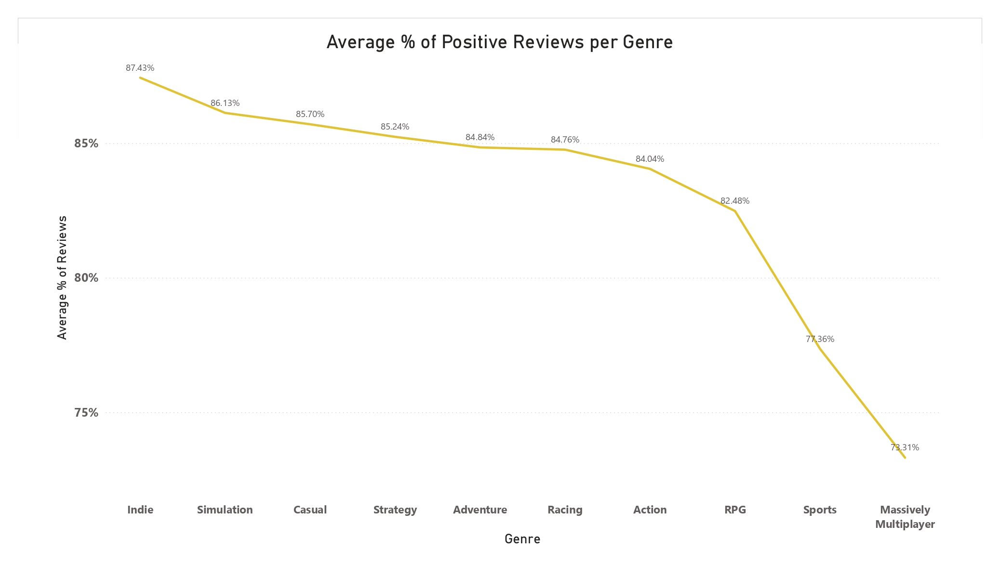

# What Keeps Players in Steam: A Behavioral Analysis of Game Lifecycle, Genre Dynamics, and Content Impact

## Overview
This project investigates **player behavior on the Steam platform**, focusing on the lifecycle of games, differences across genres, and the role of content in retaining engagement. Using real data and interactive dashboards, we aim to identify what keeps players coming back — or dropping off — over time.

## Tools & Dataset
- **Data collection:** Python (SteamSpy public data)
- **Data cleaning & transformation:** Google Sheets
- **Visualization:** Power BI
- **Dataset:** [SteamSpy public data](https://steamspy.com/api.php), [SteamCharts API scraping](https://steamcharts.com/)

---

## Section 1 – Game Lifecycle Analysis

### Goal
To analyze how Steam games perform over time after release: how fast they grow, when they peak, and how quickly player engagement drops. This helps understand the “life expectancy” of a game in the platform's ecosystem.

#### Distribution of Games by Genre

*Key Observations:*

- Dominant Genres: Action (668 games), Adventure (376), and Indie (364) are most prevalent.

- Market Diversity: RPG (253) and Strategy (209) also hold significant shares, with Simulation, Massively Multiplayer, Casual, Sports, and Racing adding to the platform's variety.

- Implication: This genre distribution helps inform game selection for deeper lifecycle analysis and suggests potential correlations between genre and player retention patterns.

#### Distribution of Games by Price

*Key Observations (Price):*

- Dominance of Paid Games: The largest segment is $10 - $29.99 (39.3%), followed by $0.01 - $9.99 (24.6%) and $30+ (16.9%).

- Significant Free-to-Play Presence: Free-to-Play games account for a notable 19.2% of titles.

- Implication: Price category is a critical factor influencing player acquisition and potential retention. Understanding this distribution helps contextualize player behavior, as expectations and engagement models often differ significantly between paid and free-to-play titles. This will be crucial when analyzing player longevity across various pricing strategies.

#### Game Ownership by Genre: Average vs. Total Owners

To understand player base size across genres, we examine both the average number of owners per game and the total sum of owners within each genre. This comparison provides insights into genre popularity and saturation.

Average Owners per Game by Genre:

Sum of Owners by Genre:

*Key Observations & Comparison:*

- *Massively Multiplayer Leads in Average Ownership:* The "Average Owners per Game by Genre" chart clearly shows *Massively Multiplayer* games having the highest average owners (nearly 8M), indicating that while there are fewer such games, they attract a very large individual player base. Action and Adventure follow.

- *Action Dominates Total Ownership:* Conversely, the "Sum of Owners by Genre" chart reveals *Action* games have the highest total number of owners (over 4.5 billion). This is due to the sheer volume of Action titles (as seen in the "Distribution by Genre" chart). Adventure and Indie also contribute significantly to total owners.

- *Disparity between Average and Sum:* This comparison highlights a crucial distinction:

  - Genres like *Massively Multiplayer* (and to some extent, Sports and Casual) achieve high average ownership per game, suggesting that the existing titles in these genres are highly successful in attracting users.
  
  - Genres like *Action, Adventure*, and *Indie,* despite having a lower average ownership per game, collectively command the largest total player base due to their vast number of titles.

- *Implication:* For player retention analysis, this means we should consider both metrics. High average ownership in a genre (e.g., Massively Multiplayer) points to a strong ability of individual games to attract and potentially retain players, while high total ownership in a genre (e.g., Action) signifies a large pool of potential players but also intense competition for their attention. Understanding this dynamic will be key when analyzing the lifecycle and competitive impact within specific genres.

#### Average % of Positive Reviews per Genre

*Key Observations (Reviews):*

- *High Satisfaction in Indie & Simulation:* Genres like Indie (87.43%) and Simulation (86.13%) boast the highest average positive review percentages, suggesting strong player satisfaction and alignment with player expectations.

- *Gradual Decline:* A general trend shows a gradual decrease in positive review percentages across genres from left to right, with Casual, Strategy, Adventure, and Racing maintaining strong positive sentiment.

- *Lower Satisfaction in Competitive/Massive Genres:* Sports (77.36%) and especially Massively Multiplayer (70.31%) genres show the lowest average positive review percentages. This might indicate higher player expectations, more frequent balance changes leading to discontent, or a more critical player base often found in competitive and long-running online games.

- *Implication:* Player sentiment, as reflected in positive review rates, is a vital indicator of game quality and player experience. While it doesn't directly measure retention, high positive reviews often correlate with satisfied players who are more likely to stay engaged. Conversely, lower review scores in certain genres might highlight areas where player expectations are not consistently met, potentially impacting long-term retention. This analysis will help us explore the relationship between initial sentiment and sustained player engagement.

#### Average vs. Median Playtime by Genre (in Minutes)

*Key Observations (Playtime):*

- *Significant Skew in Playtime:* For almost all genres, the Average Playtime (dark purple bars) is significantly higher than the Median Playtime (grey bars). This indicates that a small group of highly engaged players (outliers) heavily inflates the average, while the median provides a more representative view of playtime for the typical player.

- *Sports Leads in Average Playtime:* Sports games show the highest average playtime (6.6K minutes), but their median playtime is relatively modest (3.2K minutes), suggesting some players spend an extremely long time in these games.

- *MMO vs. Action Playtime:* Massively Multiplayer games have a high average playtime (3.9K minutes), but their median is only 0.5K minutes (500 minutes). Action games, despite their high number of titles and total owners, have a lower average (2.2K minutes) and median (0.6K minutes) playtime.

- *Indie and Casual Playtime:* Indie and Casual games show the lowest average and median playtimes, which is expected given their typical design (often shorter, more accessible experiences).

- *Implication:* This comparison between average and median playtime is crucial for understanding true player engagement. While averages might look impressive, the median often reveals that a large portion of players engage for a relatively short period. For retention analysis, focusing on strategies to increase median playtime, or understanding why average playtime is so skewed, becomes important. It also suggests that genres with a high average playtime (like Sports and MMOs) are capable of creating strong long-term engagement for a dedicated segment of their player base, even if the majority play less.

