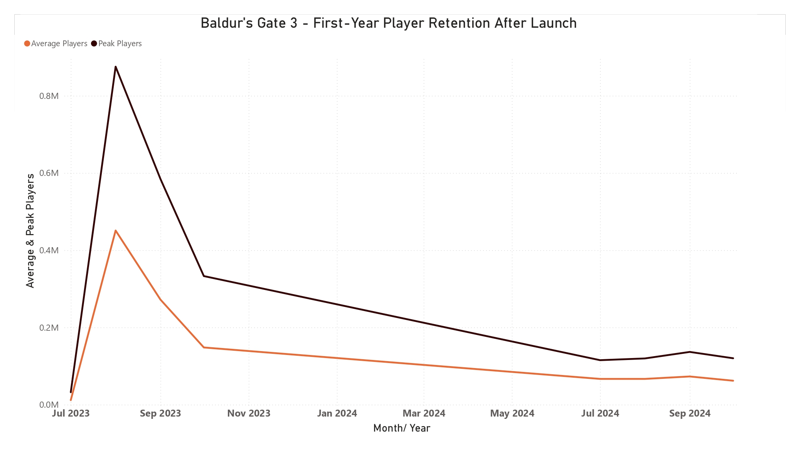
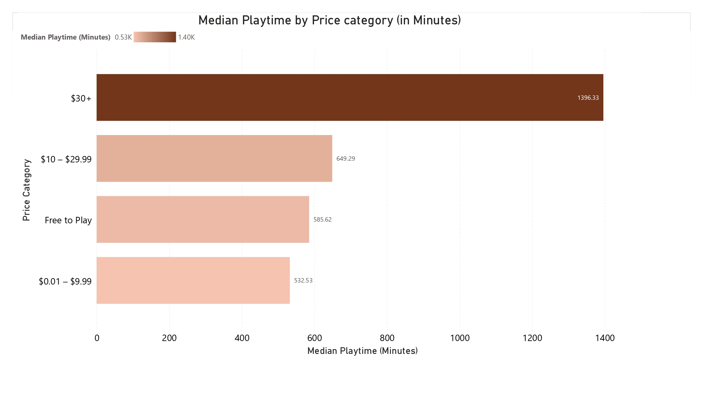

# What Makes a Game Successful on Steam? Insights from 1000 Games

 

## Table of Contents

1. [Project Overview](#Project Overview)
2. [Tools & Dataset](#tools--dataset)
3. [Section 1 – Game Lifecycle & Market Segmentation](#section-1--game-lifecycle--market-segmentation)
   - [Market Landscape: Genre Distribution](#market-landscape-genre-distribution)
   - [Distribution of Games by Price](#distribution-of-games-by-price)
   - [Game Ownership by Genre](#game-ownership-by-genre-average-vs-total-market-share)
   - [Player Satisfaction by Genre](#player-satisfaction-analysis-positive-review-rates-by-genre)
   - [Engagement Patterns: Playtime by Genre](#player-engagement-patterns-average-vs-median-playtime-by-genre)
   - [Business Summary – Section 1](#business-summary--section-1-market--lifecycle-insights)
4. [Section 2 – Behavioral Patterns: Lifecycle Case Studies](#section-2--behavioral-patterns-lifecycle-case-studies)
   - [Lifecycle Graphs (The Sims, Hogwarts, etc.)](#hogwarts-legacy--hype-spike--sharp-decline)
   - [First-Year Retention: Cyberpunk vs Baldur’s Gate](#business-question-2-first-year-retention-after-release)
   - [Business Summary – Section 2](#business-summary--section-2-behavioral-patterns--retention)
5. [Section 3 – Game Features & Player Engagement](#section-3--game-features--player-engagement)
   - [Genre vs Retention](#genre-vs-retention-which-game-types-keep-players-longer)
   - [Price vs Retention](#price-vs-retention-do-players-engage-more-with-expensive-games)
   - [Reviews vs Retention](#do-positive-reviews-correlate-with-retention)
   - [Business Summary – Section 3](#business-summary--section-3-what-drives-player-retention)
6. [Section 4 – A/B Test: Early Access vs Full Release](#section-4--ab-test-the-effect-of-early-access-on-player-retention)
   - [Total Owners Comparison](#1-total-owners-by-release-type)
   - [User Review Scores Comparison](#2-early-access-vs-full-release--average-user-review-score)
   - [Player Retention Comparison](#3-early-access-vs-full-release--median-player-retention)
   - [Business Summary – Section 4](#business-summary--section-4-the-impact-of-early-access-on-retention)
7. [Final Summary – What Makes Players Stay](#final-summary--what-makes-players-stay)

## Project Overview

This is a **personal data analysis project** where I explored **what makes players stay or leave** across **1,000 games on the Steam platform**.

Using **real-world data**, I analyzed **game lifecycles**, **genre patterns**, **player reviews**, and the impact of **Early Access** and **content features**. My goal was to identify **behavioral trends** and **success factors** that can help **game studios** and **product teams** optimize **retention** and **player engagement**.

This project combines **exploratory analysis** with **real product thinking** — and is designed as a **practical case** for **business-oriented game analytics**.

 

## Tools & Dataset
- **Data collection:** Python (SteamSpy public data)
- **Data cleaning & transformation:** Google Sheets
- **Visualization:** Power BI
- **Dataset:** [SteamSpy public data](https://steamspy.com/api.php), [SteamCharts API scraping](https://steamcharts.com/)

---

 

## Section 1 – Game Lifecycle & Market Segmentation

### Business Question
**What types of games sustain player interest over time — and what patterns lead to early drop-off?**  
Understanding lifecycle curves helps studios plan for content updates, predict revenue cycles, and prioritize support efforts.
#

### Market Landscape: Genre Distribution
Before diving into retention behavior, it's critical to understand the genre composition of the Steam market.  
This distribution sets the context for comparing lifecycle trajectories and engagement levels across game types.

### Key Findings

- **Action** dominates the market with **668 titles**, indicating high player interest but also intense competition.
- **Adventure (376)** and **Indie (364)** games represent substantial market share, offering opportunities with slightly less saturation.
- **RPG (253)** and **Strategy (209)** maintain a strong presence, often associated with higher engagement and longer playtime.
- **Niche genres** like **MMO, Sports, and Racing** cater to specialized audiences and may offer higher retention in smaller but loyal player bases.

   
### Distribution of Games by Price

### Key Findings

- **Mid-range pricing ($10–$29.99)** dominates the market, representing **39.3%** of all titles — indicating a strong standard pricing band for paid games.
- **Budget games ($0.01–$9.99)** account for **24.6%**, highlighting a large segment of low-cost indie or casual games.
- **Free-to-play (F2P)** titles make up a significant **19.2%**, reflecting the popularity of alternative monetization models.
- **Premium-priced games ($30+)** represent **16.9%**, suggesting a smaller but potentially high-margin niche for AAA-style experiences.
  
   
### Game Ownership by Genre: Average vs. Total Market Share

To understand player distribution across genres, I compare **average ownership per game** with **total market volume**.  
This dual perspective highlights both **individual game success** and **genre-level saturation**, uncovering key differences in competitive dynamics.

**Average Owners per Game by Genre:**

**Sum of Owners by Genre:**

### Key Findings

#### Individual Game Performance
- **Massively Multiplayer (MMO)** games lead with nearly **8M average owners per title**, far exceeding other genres.
- **Action** and **Adventure** follow, but with lower per-game averages due to genre saturation.
- **Sports** and **Casual** genres show unexpectedly strong individual performance despite smaller market share.

#### Total Market Volume
- **Action** dominates in total owners: over **4.5 billion combined**, driven by volume.
- **Adventure** and **Indie** also show high total reach due to large title counts.
- **MMOs**, while strong per title, represent a smaller slice of overall ownership.

#### Market Structure & Strategic Insight

- Some genres have **only a few games**, but each of them has **a lot of players** (like **MMO** and **Sports**).
- Other genres have **many games**, but each game gets **fewer players on average** (like **Action**, **Adventure**, and **Indie**).

This means studios should think differently depending on the genre:

- **MMO games** need long-term support and ways to keep players coming back.
- **Action games** need strong marketing, regular updates, and active communities to stand out in a crowded space.

   
### Player Satisfaction Analysis: Positive Review Rates by Genre

This chart shows the average % of positive reviews for each genre. It helps us understand how happy players are with different types of games.

### Key Findings

#### Top-Rated Genres
- **Indie games** have the highest player satisfaction — **87.43%** of reviews are positive.
- **Simulation** and **Casual** games also perform well, with over **85%** positive reviews.
- **Strategy, Adventure, and Racing** games stay in the **80%+** range, showing strong overall approval.

#### Lower-Rated Genres
- **Sports games** receive fewer positive reviews (**77.36%**).
- **MMO (Massively Multiplayer)** games rank the lowest, with only **73.31%** of reviews being positive.

#### Review Patterns
- There is a **clear drop** in satisfaction from Indie to MMO games.
- **Competitive and online genres** tend to have lower scores — possibly due to technical issues, high expectations, or balancing problems.

   
### Player Engagement Patterns: Average vs. Median Playtime by Genre
This chart shows how long players spend in games, using two metrics:
- **Average playtime** = total minutes played divided by number of players  
- **Median playtime** = the middle value, showing what a "typical" player does

Looking at both helps understand how many players really stay active — and how a small group of heavy users can change the numbers.

### Key Findings

#### Playtime Distribution
- In every genre, **average playtime is much higher than median**.
- This means a few very active players play a lot, while **most players spend less time**.
- The **median playtime shows a more realistic view** of what regular players actually do.

#### Genre-Based Engagement
- **Sports games** have the **highest average playtime** (6.6K minutes), but median is only 3.2K.
- **MMO games** show the biggest gap: average = 3.9K vs. median = 0.5K.
- **Action games** are more balanced: average = 2.2K, median = 0.6K.
- **Indie and Casual games** have the **lowest playtime** in both average and median.

#### Player Behavior Insights
- A clear **“whale effect”** is present — a few very loyal players boost the numbers.
- **Most players play only a little**, no matter the genre.
- **Competitive genres** (like MMO and Sports) have wider gaps between casual and hardcore players.
#

### Business Summary – Section 1: Market & Lifecycle Insights

#### Key Patterns
- **Action games** flood the market, but fight for attention.
- **MMOs** show massive success per title, but with fewer releases.
- **Simulation and Indie** games lead in player satisfaction (85–87%+).
- Playtime data shows a strong **“whale effect”** — most players engage briefly, while a few skew the averages.

#### Takeaways for Game Teams
- **Genre choice defines your strategy**: High-volume genres need standout content and marketing; niche genres benefit from deeper retention design.
- **Don’t trust the average** — median playtime is more realistic for measuring real engagement.
- **Player expectations differ**: Competitive games need support and balance; slower-paced genres need polish and long-term hooks.

---

## Section 2 – Behavioral Patterns: Lifecycle Case Studies

### Business Question

**How do different types of games retain players over time — and what engagement patterns can guide post-launch decisions?**  
Understanding lifecycle curves helps studios plan updates, allocate marketing budgets, and set realistic expectations for player retention.

### Methodology

I selected 4 games with different behavioral profiles:
- **The Sims 4** – a classic example of long-term, stable player retention
- **Hogwarts Legacy** – a highly hyped single-player release with a sharp post-launch drop
- **No Man's Sky** – a rare case of revival through continuous updates after a weak start
- **Stardew Valley** – a slow-burning indie success with organic, sustained growth

Each game is shown with a line chart of monthly player counts (SteamCharts), annotated with major releases or updates where relevant.

#

### Hogwarts Legacy – Hype Spike & Sharp Decline

*Pattern:* Massive launch spike → rapid drop-off → flat long tail

*What we see:*  
Hogwarts Legacy launched in February 2023 with extremely high engagement (over 500K peak players).  
However, within 2 months, player activity dropped by ~90% and remained consistently low in the following year.

*Possible explanation:*  
This was a highly anticipated, single-player game with limited replay value and no major content updates post-launch. Once players completed the main story, few reasons remained to return.

> **Takeaway:**    
Even massive hype can’t guarantee long-term retention — without post-launch content or community hooks, player interest fades quickly.

### No Man’s Sky – Revival Through Updates

*Pattern:* Initial collapse → slow comeback → long-term growth through updates

*What we see:*  
After a disappointing launch in 2016, player numbers fell sharply in 2017.  
However, from 2018 onward, we see a steady rise in both average and peak players — driven by a continuous stream of major updates and improvements.

*Possible explanation:*  
The developers committed to rebuilding the game post-launch with free expansions, feature reworks, and strong communication — eventually rebuilding player trust and engagement.

> **Takeaway:**  
A weak launch doesn’t mean failure — long-term player retention is possible through consistent updates and community care.

### The Sims 4 – Long-Term Growth & Steady Engagement

*Pattern:* Consistent year-over-year growth with strong retention

*What we see:*  
Since 2020, The Sims 4 has shown stable growth in both average and peak players.  
Engagement increases each year, with no major dips — a rare example of a long-running title gaining momentum over time.

*Possible explanation:*  
Frequent content packs, seasonal events, strong community support, and modding culture keep players coming back. The game's open-ended nature supports long-term play.

> **Takeaway:**  
Steady growth is possible when games are built for longevity — with regular updates and systems that support ongoing engagement.

### Stardew Valley – Organic Growth & Community-Driven Longevity

*Pattern:* Gradual long-term growth → major resurgence post-2023

*What we see:*  
After a modest launch in 2015, Stardew Valley steadily gained players over time.  
A massive spike in 2023–2024 suggests renewed interest — possibly due to major updates, platform expansions, or social buzz.

*Possible explanation:*  
The game’s relaxing gameplay, strong word of mouth, active modding scene, and continued developer support built a loyal player base.  
Viral moments and re-releases helped reintroduce the game to new audiences.

> **Takeaway:**  
Games don’t need explosive launches to succeed — slow, steady growth powered by community and ongoing updates can lead to long-term success.

### Business Question 2: First-Year Retention After Release

**How do games perform in the first 12 months after launch — and how quickly does interest fade?**  
This helps game studios understand when engagement drops off, how quickly a player base stabilizes, and whether post-launch retention matches expectations.

### Methodology

To analyze early-stage engagement, I visualized **monthly average and peak players** during the first year after launch.  
Two contrasting examples highlight retention dynamics:

- **Cyberpunk 2077** – massive launch with a steep and sudden decline  
- **Baldur’s Gate 3** – also highly anticipated, but with slower decay and stronger post-launch retention

These comparisons help identify whether a game’s lifecycle depends on pre-release hype or long-term content value — and what product strategies (updates, live service, DLC) can support better retention.

#### Cyberpunk 2077 – First-Year Player Retention After Launch

**Key Findings:**

- Explosive launch: over 830K peak players at release
- Rapid drop-off: engagement fell by ~90% within 2 months
- Long tail: minor activity stabilizes around 10–20K players
- Post-launch updates had little effect on reversing decline

**Interpretation:**  
Cyberpunk’s performance reflects a high-risk, hype-driven model. Strong marketing pushed record-breaking launch numbers, but lack of polish at release led to rapid disengagement. Long-term retention was minimal without substantial structural fixes.

#### Baldur’s Gate 3 – First-Year Player Retention After Launch

### Key Findings

- Strong launch: 875K peak players at release, with high average playtime
- Slower decline: steady drop-off but more gradual than Cyberpunk
- Healthy plateau: by month 6–10, retention stabilizes around 100K–150K peak
- Post-launch content and word-of-mouth sustained interest

**Interpretation:**  
Unlike Cyberpunk, Baldur’s Gate 3 shows **strong retention beyond the launch window**. Its quality, content depth, and community support created a smoother lifecycle curve. This suggests high replayability and strong product-market fit — especially in the RPG niche.

#

### Business Summary – Section 2: Behavioral Patterns & Retention

#### Key Patterns
- **Lifecycle curves vary greatly**: Some games spike and fade fast (*Hogwarts Legacy*, *Cyberpunk 2077*), while others grow or stabilize over time (*The Sims 4*, *Baldur’s Gate 3*, *Stardew Valley*).
- **First-year retention** is often steep: most games lose the majority of players in the first 3–6 months.
- **Long-term engagement** is driven by updates, community support, and replayability — not just initial hype.

#### Takeaways for Game Teams
- **Plan for the drop**: Launch peaks are unreliable — post-launch support and content timing matter more for sustainable retention.
- **Know your game's arc**: Identify whether your title is front-loaded, steady-growth, or long-tail — and align marketing + dev accordingly.
- **Retention is a product metric**: Teams should treat lifecycle analysis as early evidence for future revenue and community health.
----

## Section 3 – Game Features & Player Engagement

### Business Question

**Which game attributes drive higher player engagement — and how do features like price, genre, or tags correlate with retention?**  
Understanding which characteristics predict strong engagement helps product teams make informed decisions about design, positioning, and monetization.

#

### Genre vs. Retention: Which Game Types Keep Players Longer?

This chart shows the **median playtime (in minutes)** by genre — a more realistic measure of engagement than average time, which can be skewed by a few “whale” users.

#### Key Findings

- **Sports games** dominate retention with a median playtime of over **3,200 minutes**, suggesting strong ongoing engagement, possibly due to competitive or replayable content.
- **Simulation** titles also perform well (**1,300+ minutes median**), indicating deep, immersive mechanics.
- Genres like **RPG, Adventure, and Strategy** hold steady with **~600–800 minutes**.
- **Multiplayer, Casual, and Indie** games show **lower typical engagement** (under 550 minutes), despite possibly strong performance in other areas (e.g., satisfaction or breadth).

### Price vs. Retention: Do Players Engage More With Expensive Games?

This chart compares **median playtime** across different price categories — from free-to-play to premium titles.

#### Key Findings

- Games priced **$30+** have the **highest median playtime** (~1,400 minutes), suggesting that **premium buyers are more committed**.
- Mid-priced games ($10–29.99) also perform well (**650 minutes median**), offering a solid balance of price and engagement.
- Surprisingly, **Free-to-Play** games outperform the lowest paid tier, with **~586 minutes**, vs. ~533 for the $0.01–9.99 range.
- Ultra-cheap games likely suffer from low perceived value or shallow gameplay loops.

### Do Positive Reviews Correlate With Retention?

This scatterplot explores the relationship between **positive user reviews (%)** and **median playtime** across all games in the dataset.

#### Key Findings

- There’s a **visible upward trend**: games with better reviews generally see longer median playtime.
- Games below **60–70% positive reviews** almost never retain players long — **short engagement dominates**.
- **Outliers with 20%+ reviews** show sustained playtime of **2000–5000 minutes**, often associated with highly polished or community-supported games.
- A **baseline median** (around 700 minutes) divides weak from solid retention.

### Business Summary – Section 3: What Drives Player Retention?

#### Key Patterns
- **Sports and Simulation** games lead median playtime, suggesting deep, repeatable engagement.
- **High-priced games ($30+)** drive longer sessions, likely due to better quality, polish, or content depth.
- **Positive reviews strongly correlate** with higher retention — games with 85–95%+ positivity retain players far longer.

#### Takeaways for Game Teams
- **Retention starts with quality**: Invest in polish, UX, and stability to increase playtime and positive sentiment.
- **Monetization and design go hand-in-hand**: Premium games show stronger retention — but expectations are higher too.
- **Watch your reviews**: They aren’t just vanity metrics — they’re predictors of engagement and long-term ROI.

---

## Section 4 – A/B Test: The Effect of Early Access on Player Retention

### Business Question

**Does launching in Early Access improve or reduce player retention?**  
Early Access lets studios launch faster and gather feedback — but does it help keep players engaged, or does an unfinished experience drive them away?

#

### Methodology

To test this, I ran a simplified A/B test:

- **Test group:** 98 games with the `Early Access` tag  
- **Control group:** 98 randomly selected games without the tag  
- Both groups were balanced by size and analyzed by key engagement metrics:
  - **Median Playtime** (to reduce outlier bias)
  - **User Review Score**
  - **Ownership scale**

This approach enables a focused comparison of real-world player behavior between two common release strategies.

#### 1. Total Owners by Release Type

**Hypothesis:**  
Games launched directly into **Full Release** will have a higher total number of owners compared to games that went through **Early Access**, due to broader marketing campaigns and a more polished initial product attracting a larger initial audience.

**Key Observations:**
- Games launched directly into Full Release account for a significantly larger portion of total owners (**~1.75 Billion**).
- Games that started with Early Access have a substantial, but smaller, total owner base (**~0.75 Billion**).

**Conclusion:**  
The data **supports the hypothesis**. Full Release titles collectively attract a **much larger overall player base**. This could be attributed to traditional marketing cycles and the broader appeal of a finished product at launch, whereas Early Access titles typically build their audience more incrementally, often starting with a smaller, dedicated community.

#### 2. Early Access vs Full Release – Average User Review Score

**Hypothesis:**  
Games that go through **Early Access** will have a **lower average user review score** compared to **Full Release** titles. This is based on the expectation that Early Access games are inherently unfinished, leading to more critical reviews.

**Key Observations:**
- Full Release games show a **slightly higher average user review score** (around **0.82**).
- Early Access games have a **marginally lower score** (around **0.79**).
- The difference between the two groups is **relatively small**.

**Conclusion:**  
The data **supports the hypothesis** — Full Release games tend to have slightly better review scores, likely due to being more polished at launch. However, the **small gap suggests that Early Access doesn't significantly harm player sentiment**. Many players seem to understand the unfinished nature of Early Access and rate accordingly, especially when games show consistent improvement and communication.

#### 3. Early Access vs Full Release – Median Player Retention

**Hypothesis:**  
Games that undergo **Early Access** will have **higher median player retention**, as their audiences are more invested and accustomed to ongoing development.

**Key Observations:**
- **Full Release** games show **higher median playtime** (≈ **1700 minutes**).
- **Early Access** games show **lower median playtime** (≈ **500 minutes**).

**Conclusion:**  
The data **contradicts the hypothesis**. Full Release games retain players longer on average. This may reflect:
- **Higher initial polish and content** in full releases
- **Stronger commitment** from players expecting a complete experience
- **Shorter, update-driven sessions** in Early Access titles lowering the median

#

### Business Summary – Section 4: The Impact of Early Access on Retention

Our comparative analysis of **Early Access** vs. **Full Release** games revealed clear differences in player reach, perception, and long-term engagement.

#### Audience Reach
- **Full Release** titles reach a **much larger total audience**.
- This suggests that polished, fully launched games — often backed by stronger marketing — attract broader player bases from the start.

#### Perceived Quality
- **Early Access** games show **slightly lower average review scores**, but the difference is minor.
- This indicates that players generally **understand the unfinished nature** of Early Access and can still rate a title positively if it's well-managed.

#### Long-Term Retention (Median Playtime)
- Surprisingly, **Full Release** games show **significantly higher median playtime**.
- This contradicts the idea that Early Access fosters longer engagement.
- Possible reasons include:
  - **More content** and a polished experience at launch
  - **One-time full playthroughs** being longer than sporadic Early Access sessions

#### Key Takeaway
While **Early Access** can help build community and gather feedback, it does **not automatically lead to higher long-term retention**. 

Studios should weigh the **initial reach of a full launch** against the **gradual growth of Early Access**, keeping in mind that both models demand consistent quality and player alignment.

## Final Summary – What Makes Players Stay?

This project explored player behavior across 1,000 Steam games to uncover what drives **retention, satisfaction, and long-term success** in the PC game market.

### What I Learned

- **Market dynamics shape expectations**: Action games dominate in volume, but MMOs lead in per-game success. Indie and Simulation genres top satisfaction charts.
- **Lifecycle patterns matter**: Some games burn bright and fade (e.g. Hogwarts Legacy), while others thrive through slow growth or revival (e.g. Stardew Valley, No Man’s Sky).
- **Player engagement is uneven**: Median playtime is a better metric than averages due to the “whale effect” — a few players skew the numbers.
- **Tag-level and price insights**: Tags and pricing tiers reveal strong correlations with engagement — high-priced titles show strong retention, certain genres attract longer sessions.
- **A/B test results** challenge assumptions: Early Access doesn’t guarantee higher retention, and full releases tend to drive stronger sustained playtime.

### Strategic Takeaways for Game Teams

- **Choose your genre wisely**: Volume-heavy genres require standout content and strong marketing. Niche genres rely on depth and community.
- **Track the right metrics**: Use **median playtime** for realistic engagement estimates and **ownership scale** to gauge reach.
- **Early Access is not a silver bullet**: It builds community but needs long-term support to match the retention of full releases.

### Next Steps & Extensions

This project can evolve in several directions:

- **Retention cohorts by release month or year**
- **Event-based analysis**: Do discounts, patches, or DLC spikes actually improve engagement?
- **Monetization analysis**: How does free-to-play vs. premium pricing affect long-term play?
- **Player sentiment NLP**: Deeper analysis of reviews to detect pain points or love signals
- **Success forecasting** using features like price, genre, tags, and EA status

---
